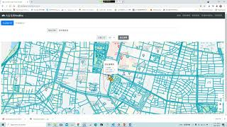

# EE 3035, Web Programming, 109-2
## Final Project: 大台北找YouBike

### Demo
https://youtu.be/ufst-hSDnlU \
[](https://youtu.be/ufst-hSDnlU)

### 1. 如何在 localhost 安裝與測試之詳細步驟

本專題和平常上課作業的開啟步驟基本相同，首先請開啟兩個terminal，並且讓他們都在 final 目錄底下：
```
$ cd final
```
- server端
1. 請先在 backend 目錄下創立一個 .env 檔案， .env 檔案的內容格式如下：
```
MONGO_URL=<你的MongoDB url>
```
2. 請讓其中一個terminal進到 backend 目錄底下，並且輸入 yarn install 指令安裝後端的 node_modules：
```
$ cd backend
$ yarn install
```
3. 成功安裝後就可以輸入 yarn server：
```
$ yarn server
```
4. 請稍等大約15秒鐘，如果一切順利terminal應該會出現以下文字：
```
Listening on port 8888
mongo connected!
getTaipeiVer1 success
getTaipeiVer2 success
getNewTaipeiVer1 success
Initialize database success!
```

- client端
1. 請讓另一個terminal進到 frontend 目錄底下，並且輸入 yarn install 指令安裝前端的 node_modules：
```
$ cd frontend
$ yarn install
```
2. 成功安裝後就可以輸入 yarn start：
```
$ yarn start
```
3. 請稍等大約30秒鐘，如果順利應該會跳出localhost:3000視窗，並且看到Google地圖。

### 2. 每位組員之負責項目
單人組別。

### 3. 如果此專題是之前作品/專題的延伸，請務必在此說明清楚
此專題和之前我做的 https://github.com/ShihPingLin/Taipei_Find_YouBike_Website.git 概念接近，但是不同的點如下：

- 當時使用python flask搭配jinja模板，這次我全部改用react跟express重寫
- 當時只有查詢台北YouBike1.0的功能，這次除了台北YouBike1.0，還加入了台北YouBike2.0、新北YouBike1.0
- 加入車站搜尋的功能
- 在新增常用車站的部分加入關鍵字搜尋的功能
- 當時沒有連結資料庫，這次有連結MongoDB
- 更新使用說明

總體來說，我覺得這個作品幾乎就是一個新的作品。

### 4. Deploy連結：https://greater-taipei-find-ubike.herokuapp.com/
- 第一次開啟需要等heroku主機開機，大約需要30秒
- 點一個按鍵後大約需要等5秒，這有可能是因為heroku，另外我覺得我的後端應該也有更快更好的寫法。

### 5. Demo影片連結：https://youtu.be/ufst-hSDnlU

### 6. 描述這個服務在做甚麼
大台北找Youbike希望能讓大家騎Youbike可以更方便。主要有以下三個功能：一、尋找你目前位置附近的Youbike站點，二、尋找目的地Youbike車站以及該車站附近的站點，三、加入常用車站。這個網站結合了Google map和台北Youbike1.0、2.0跟新北Youbike1.0，並且考慮了響應式網站設計，讓這個網站在各種手機上也能有好的使用者體驗。

### 7. 其他說明
我期望我的網站簡單直覺，能在地圖上只顯示需要顯示的車站，而且能在1.0和2.0模式間方便地切換，最終目標是希望讓使用者在需要的時候可以輕鬆快速地找到車站。

### 8. 使用的框架、套件與技術
- 前端：Google Map Javascript Api、Bootstrap、React Router、React Hook、Axios和後端溝通、Css、Html5
- 後端：Axios串接政府微笑單車api、Mongoose、Nodejs、Express、Babel、cors、dotenv-defaults
- 資料庫：MongoDB

### 9. 專題製作心得
電機所碩一 林士平 R09921057 \
平常我就很常騎Youbike，但是我覺得市面上相關的app使用上都太麻煩了，這次可以親手打造一個網站並且真的可以應用在日常生活我覺得很開心。在製作過程我學到應該要在一開始就先把後端要開什麼api，前端畫面要怎麼呈現、要怎麼要資料都先規劃好，而不是邊做邊想，因為邊做邊想害我走了不少錯路，多花很多時間。最後，這個專題還有很多可以改進和延續的地方，比如：用React Native真的做成一個app、改善後端的演算法讓速度加快、重新規劃資料庫的存取方式讓資料取用更有效率、改成用速度更快的雲端來部屬。期望未來我能真的實現這些改進。